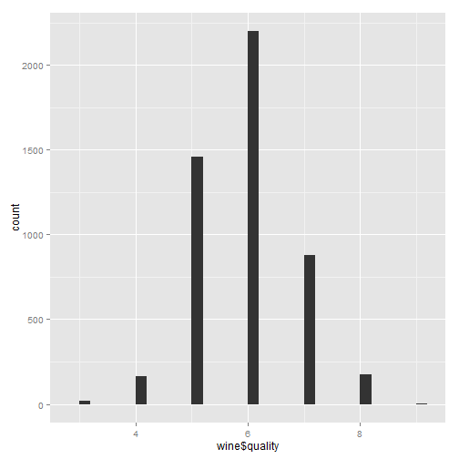
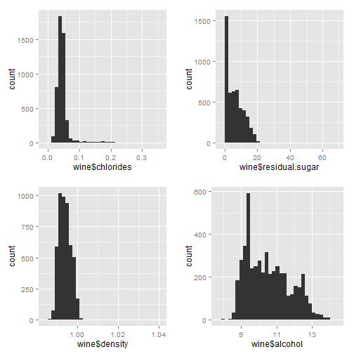
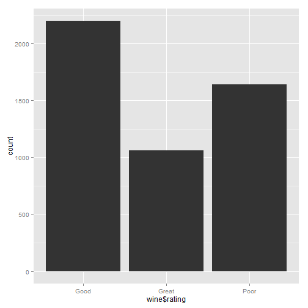
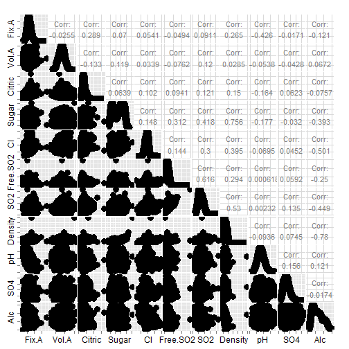
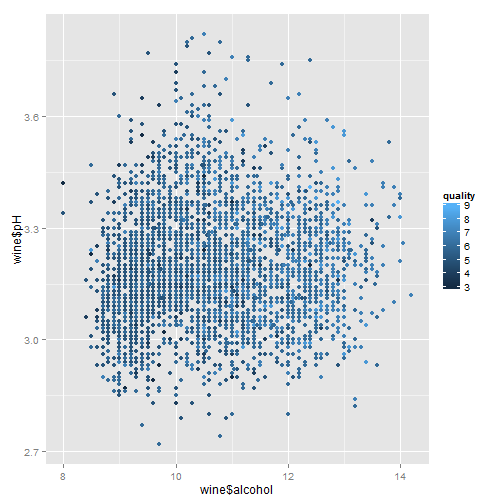
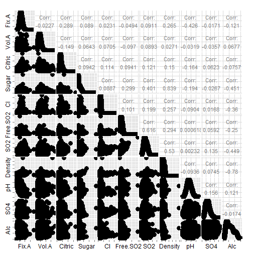
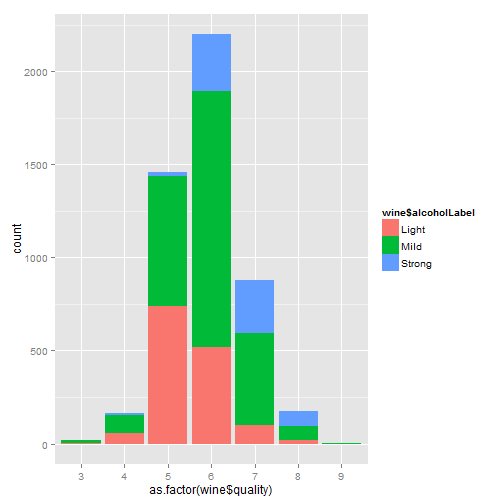
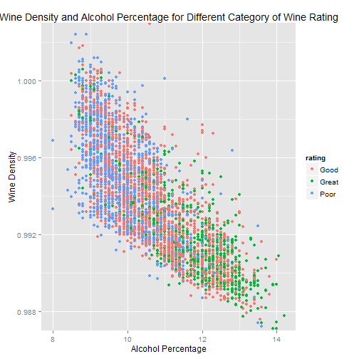
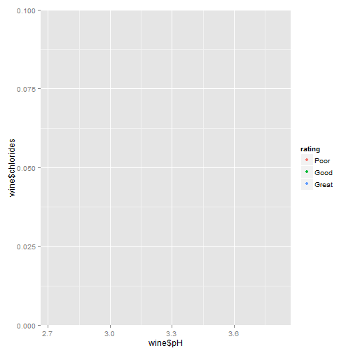
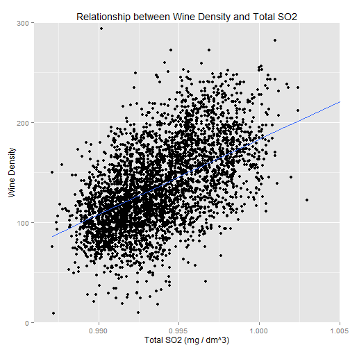

## Understanding Dataset and Objective

Wine industry is a lucrative industry which is growing as social drining is on rise. There are many factors that make the taste and quality of wine unique. These factors are but now limited to the followings:

* acidity

* pH level

* sugar remained in wine

* chlorides

In this project we use a dataset of wines. In this dataset there are 4898 observations of White Wines that are produced in Portugal. Different properties of each wine is tested and collected for this dataset. Also, Each variety of wine is tasted by three independent tasters and the final rank assigned is the median rank given by the tasters.

In this project, I try to understand this dataset better and also try to find out if there is a relationship between quality of wine and different properties of it.


## EDA


### Structure of dataset

Initially we start just looking at data to understand their features better.


```
## 'data.frame':	4898 obs. of  13 variables:
##  $ X                   : int  1 2 3 4 5 6 7 8 9 10 ...
##  $ fixed.acidity       : num  7 6.3 8.1 7.2 7.2 8.1 6.2 7 6.3 8.1 ...
##  $ volatile.acidity    : num  0.27 0.3 0.28 0.23 0.23 0.28 0.32 0.27 0.3 0.22 ...
##  $ citric.acid         : num  0.36 0.34 0.4 0.32 0.32 0.4 0.16 0.36 0.34 0.43 ...
##  $ residual.sugar      : num  20.7 1.6 6.9 8.5 8.5 6.9 7 20.7 1.6 1.5 ...
##  $ chlorides           : num  0.045 0.049 0.05 0.058 0.058 0.05 0.045 0.045 0.049 0.044 ...
##  $ free.sulfur.dioxide : num  45 14 30 47 47 30 30 45 14 28 ...
##  $ total.sulfur.dioxide: num  170 132 97 186 186 97 136 170 132 129 ...
##  $ density             : num  1.001 0.994 0.995 0.996 0.996 ...
##  $ pH                  : num  3 3.3 3.26 3.19 3.19 3.26 3.18 3 3.3 3.22 ...
##  $ sulphates           : num  0.45 0.49 0.44 0.4 0.4 0.44 0.47 0.45 0.49 0.45 ...
##  $ alcohol             : num  8.8 9.5 10.1 9.9 9.9 10.1 9.6 8.8 9.5 11 ...
##  $ quality             : int  6 6 6 6 6 6 6 6 6 6 ...
```

There are 4898 observations and 12 features. Input variables which includes 11 chemical features of white wine and output variable which is wine quality.

Below is brief description of each feature:
Input variables (based on physicochemical tests):

Chemical Prperties:

* fixed acidity: most acids involved with wine or fixed or nonvolatile (do not evaporate readily) (tartaric acid - g / dm^3)

* volatile acidity: the amount of acetic acid in wine, which at too high of levels can lead to an unpleasant, vinegar taste (acetic acid - g / dm^3)

* citric acid: found in small quantities, citric acid can add 'freshness' and flavor to wines (g / dm^3)

* residual sugar: the amount of sugar remaining after fermentation stops (g / dm^3)

* chlorides: the amount of salt in the wine (sodium chloride - g / dm^3

* free sulfur dioxide: he free form of SO2 exists in equilibrium between molecular SO2 (as a dissolved gas) and bisulfite ion (mg / dm^3)

* total sulfur dioxide: amount of free and bound forms of S02 (mg / dm^3)

* density: the density of water is close to that of water depending on the percent alcohol and sugar content (g / cm^3)

* pH: describes how acidic or basic a wine is on a scale from 0 (very acidic) to 14 (very basic)

* sulphates: a wine additive which can contribute to sulfur dioxide gas (S02) levels (potassium
sulphate - g / dm3)

* alcohol: the percent alcohol content of the wine (% by volume)

Output variable (based on sensory data): 

* quality (score between 0 and 10)


### Summary of dataset:


```
##        X        fixed.acidity    volatile.acidity  citric.acid    
##  Min.   :   1   Min.   : 3.800   Min.   :0.0800   Min.   :0.0000  
##  1st Qu.:1225   1st Qu.: 6.300   1st Qu.:0.2100   1st Qu.:0.2700  
##  Median :2450   Median : 6.800   Median :0.2600   Median :0.3200  
##  Mean   :2450   Mean   : 6.855   Mean   :0.2782   Mean   :0.3342  
##  3rd Qu.:3674   3rd Qu.: 7.300   3rd Qu.:0.3200   3rd Qu.:0.3900  
##  Max.   :4898   Max.   :14.200   Max.   :1.1000   Max.   :1.6600  
##  residual.sugar     chlorides       free.sulfur.dioxide
##  Min.   : 0.600   Min.   :0.00900   Min.   :  2.00     
##  1st Qu.: 1.700   1st Qu.:0.03600   1st Qu.: 23.00     
##  Median : 5.200   Median :0.04300   Median : 34.00     
##  Mean   : 6.391   Mean   :0.04577   Mean   : 35.31     
##  3rd Qu.: 9.900   3rd Qu.:0.05000   3rd Qu.: 46.00     
##  Max.   :65.800   Max.   :0.34600   Max.   :289.00     
##  total.sulfur.dioxide    density             pH          sulphates     
##  Min.   :  9.0        Min.   :0.9871   Min.   :2.720   Min.   :0.2200  
##  1st Qu.:108.0        1st Qu.:0.9917   1st Qu.:3.090   1st Qu.:0.4100  
##  Median :134.0        Median :0.9937   Median :3.180   Median :0.4700  
##  Mean   :138.4        Mean   :0.9940   Mean   :3.188   Mean   :0.4898  
##  3rd Qu.:167.0        3rd Qu.:0.9961   3rd Qu.:3.280   3rd Qu.:0.5500  
##  Max.   :440.0        Max.   :1.0390   Max.   :3.820   Max.   :1.0800  
##     alcohol         quality     
##  Min.   : 8.00   Min.   :3.000  
##  1st Qu.: 9.50   1st Qu.:5.000  
##  Median :10.40   Median :6.000  
##  Mean   :10.51   Mean   :5.878  
##  3rd Qu.:11.40   3rd Qu.:6.000  
##  Max.   :14.20   Max.   :9.000
```

Above figure shows the distribution of data over different variables. As we can see, the normal range for fixed acidity is 6.3 to 7.3 g / dm^3. As for sugar, 75% of wines in our dataset have below 9.9 mg / dm^3 sugar remaining after fermentation stops. Average alcohol percentage in our dataset is about 10.51. 


### Some plotings:

#### Distribution of data: Quality of Wine

Boxplot of wine quality:

 


Histogram of wine quality:

 

For most of the wine in our dataset, quality falls between 5 and 7 which is a range for good wines. There are couple of exceptions as excellent wine(8 or above), and poor (4 or below)


#### Distribution of data: Wine Acidity

 

Based on the bottom-right figure, wines are acidic and their pH are ranging from 2.5 to 4, however, most of wine have pH between 3 and 3.5. 

Acidic nature of wines can come from three different types of acids:

1- Fixid acidity which is for most cases between 6 and 8.

2- Volatile Acidity which is mostly in range of .1 and .5

3- Citric Acidity which is ranging from 0 to 1 but for most of wines in our dataset is between .2 and .5

These features all seem to follow a normal distribution except Volatile Acidity which is slightly right skewed. 

I will do log transformations to see if the result would be more bell-shaped:

 

It seems that log(volatile acidity) follows normal distribution (at least it is more like bell-shaped in logorithmic than regular); therefore we will use the logarithmic transofomation for our further analysis


#### Distribution of data: Density, Chlorides, Sugar and Alcohol Percentage

 

Based on the above figures, chlorides range in wines in our dataset is usually between 0 and .1 with some exceptions more than .1 g/dm^3. 

The amount of sugar remained after fermentation is rarely more than 20 g/dm^3.

Density for wine are typically less than water but very slightly. The typical range for density would be (.99, 1)

Alcohol percentage in wine is varies between 8 and 14, however for most of the wines it is between 9 and 13.

Residual Sugar and Chlorides are highly right skewed. We will do logorithmic transformation in the next step:


```
## Scale for 'x' is already present. Adding another scale for 'x', which will replace the existing scale.
```

 

Now these two are more like bell-shaped. However, still Residual sugar is far from normal distribution as it seems like two different bell in the distribution.


#### Analyzing Correlation among input variables in the dataset 

following diagrams give us a good sense of the distribution and correlation among input variables in our dataset:

 

some observations:
* Positive relationship between density and sugar remaining 
* Positive relationship between total SO2 and free SO2 
* Positive relationship between total SO2 and chlorides
* Positive relationship between alcohol and density
* Features in our data seems to follow a normal distribution

To avoid multicollinearity in model building using regressions, we have to be aware of strong correlations among input variables.

#### Analyzing correlation between Quality and input variables

We use Spearman's rho statistic to estimate a rank-based measure of association. Correlations falls between -1 and 1. 0 suggests there is no association between the two variables while numbers close to -1 or 1 suggests strong negative and positive associations accordingly.


```
##                              [,1]
## fixed.acidity        -0.113662831
## volatile.acidity     -0.197363215
## citric.acid          -0.009209091
## residual.sugar       -0.064631762
## chlorides            -0.272856661
## free.sulfur.dioxide   0.008158067
## total.sulfur.dioxide -0.174737218
## density              -0.307123313
## pH                    0.099427246
## sulphates             0.053677877
## alcohol               0.435574715
```

This also shows that wine quality has positive correlation with alcohol and negative correlation with chlorides and density


Now I will dig into relationship between wine quality and its properties more to be able to predict the quality of wine.

#### Role of pH and Alcohol in Quality of the wine

What is impact of Alcohol and pH in wine quality?

 

It is difficult to find specific pattern in this figure since quality has a wide range. I will limit the quality of wine into three categories of Poor, Good and Great to be able to differntiate patterns in each category. 


below is how the quality of wines is distributed based on the rating that I just introduced:

 


Now again we plot the two features of pH and Alcohol but this time use the new rating to see a pattern between quality and these two features:


 


According to the above scatter plot, there seems to be a relationship between alcohol percentage and rating of the wine. most of great wines are in the right side of the plot. More specifically, if the alcohol percentage is above 11% there seems to be a good chance that we will have a good or great wine (great wine has rating 7 or above, good ones has quality above 5). If it is more than 12% the chance is even higher.

However, to see the relationship better, in below chart I use only Alcohol and Quality to find out if there is actually a relationship between the two.


 

As you can see in the above stacked bar, for the higher quality wines there is more chance that the wine has higher alcohol percentage.

Here is how I categorized the alchol percentage:

* "Light": Alcohol percentage below 10%
* "Mild" : Alcohol percentage higher than 10% but below 12% 
* "Strong": Alcohol percentage higher than 12%


#### Relationship between density and alcohol percentage

 

There seems to be a correlation between density and alcohol percentage. Less dense, more alcohol. Also, great wines tend to be less dense.


#### Relationship between Quality and Chlorides

 

Wines with better quality tend to have less chlorides. If the chlorides level is higher than 0.050, there is a good chance the wine has worse rating.


### Predicting Wine Quality

Using the insights that we have now about our data, I will try to predict the quality of wine.

I will use three levels rating ("Poor", "Good", "Great") as an output variable.


```r
table(wine$rating)
```

```
## 
##  Poor  Good Great 
##  1640  2198  1060
```

This is the baseline for accuracy of our model:

2198/ (1640 + 2198 + 1060) = 0.44


#### Multinomial Logistic Regression

I will use multinomial logistic regression to classify ratings of wine.


In our earlier analysis we found that there is a strong relationship between wine quality and its alcohol percentage. Lets predict the rating of wine just based on its alcohol percentage.


Here is the prediction:


```
##        pred_mglm
##         Poor Good Great
##   Poor   918  696    26
##   Good   631 1336   231
##   Great  128  619   313
```

Accuracy = (918+1336+313)/total = 0.52

AIC: 9211.864 

We can see that just by using one variable, we could improve the baseline accuracy significantly.

In the next step we will add more variables to our model to imporve its accuracy. Based on EDA section Density, Chlorides and Volatile Acidity have strong correlation with wine quality. However, since Density and chlorides have strong association with alcohol percentage we ignore this variable to avoid multicollinearity. In our next model we predict the rating of a wine based on its alcohol percentage, chlorides and volitile acidity:


Here is the prediction:


```
##        pred_mglm
##         Poor Good Great
##   Poor   972  643    25
##   Good   531 1404   263
##   Great   62  685   313
```

Accuracy = (972+1404+313)/total = 0.55

AIC: 8838.35 

As expected the accuracy imporved significantly. 

Last step is just to use full model (all inputs) to predict quality of wine. 


Prediction:


```
##        pred_mglm
##         Poor Good Great
##   Poor   993  625    22
##   Good   487 1480   231
##   Great   53  643   364
```

Accuracy: (946 + 1495 + 369)/ total = 0.58

AIC: 8602.719 

As you can see, we added 8 more variables to our model and accuracy imporved 3% which suggests that whether combination of other variables are not really impactful in predicting the output or our model is not leveraging the data well (perhaps because there multicollinearity, or the relationship between the input and output is not linear or etc.)

Also we can compare the Akaike information criterion (AIC) for the three models and we can see that from the first model to the second one the AIC improved significantly but from the second model to the full model it improved slightly.


#### Decision Tree

Using Decision Trees to predict Alcohol Quality:

 

As we see in the tree, the wine is predicted to be *Great* if its alcohol percentage is 13% or higher. It is predicted as *Poor* if alcohol percentage is below 11% and its log(volatile acidity) is equal or greater than -1.4.

Here is the confusion matrix based on this model:


```
##        pred_CART
##         Poor Good Great
##   Poor   983  643    14
##   Good   565 1514   119
##   Great   62  776   222
```

Accuracy = (983+1514+222)/total = 0.56

This is a very effective and readable model. We just used two of input variables to predict the quality. For the next model, we make it more complicated:


 

In above model we used following variables to predict quality: alcohol, free sulfur dioxide, pH, sulphate and volatile acidity. 

Now let's see the confusion matrix:


```
##        pred_CART
##         Poor Good Great
##   Poor   868  749    23
##   Good   387 1651   160
##   Great   30  720   310
```

Accuracy = (868+1651+310)/total = 0.58

This is the best accuracy that we could achieve so far

#### Random Forest

As out last model we will use random forest classification to predict quality of wine.


Now let's see the confusion matrix:


```
##        pred_RF
##         Poor Good Great
##   Poor  1229  393    18
##   Good   302 1716   180
##   Great   20  325   715
```

Accuracy ~ 0.75

Well!! The accuracy imporved amaingly! But does it mean that it is the best model to predict wine quality? I will discuss this in last section of the project when I will suggest future analysis.

##Final Plots and Summary

#### Histogram of Wine Quality:

 
 
#### Histogram of Alcohol Percentage:

 


#### Is there any relationship between Alcohol percentage and Wine Density? Do these features impact wine rating?

 


## Reflection

Based on the EDA and further analysis that I did for this dataset, I am convinced that Alcohl percentage is the most important factor to decide the quality of White wine. One important factor that contributes to Alcohol percentage is the remaining sugar in wine after fermentation so that the more sugar left after fermentation, the less the percentage of alcohol will be in the wine.

Other important factors for deciding the quality of a white wine are SO2 and Volatile Acidity. Free SO2 has positive relationship with the quality of white wine while Volatile Acidity has negative one! 


## Future Analysis

There is defenitely a great room to do further analysis and come with better models. Below is some ideas to make this study even better:

* In this project the models were evaluated using the same data that was trained. This is not recommended. Performance should be reported based on the seperate set of data. Therefore, for future studies I recommend to split data into train and test and then do the analysis.

* In the last model, we used Random Forest Classification which is very prone to over-fitting. Using seperate train and test data would help to report right number for performance. Also we can use Cross Validation to adjust the parameters of the classification method.

* The only crriteria we used for perfomance was accuracy. While it is indicative of our model's performance, it is not exhaustive yet. A better idea would be to look at the prediction and see how was the prediction are from actual data. For example if a Great wine is predicted as Good, it is more tolerable than if it is predicted as Poor. Therefore we can use weighted accuracy measures to report on performance.


##References

1. Data is taken from the following source:

P. Cortez, A. Cerdeira, F. Almeida, T. Matos and J. Reis. 

  Modeling wine preferences by data mining from physicochemical properties.
  In Decision Support Systems, Elsevier, 47(4):547-553. ISSN: 0167-9236.

  Available at: 
  [@Elsevier] http://dx.doi.org/10.1016/j.dss.2009.05.016
  
  [Pre-press (pdf)] http://www3.dsi.uminho.pt/pcortez/winequality09.pdf
            
  [bib] http://www3.dsi.uminho.pt/pcortez/dss09.bib

2. https://s3.amazonaws.com/udacity-hosted-downloads/ud651/wineQualityInfo.txt

3. https://onlinecourses.science.psu.edu/stat857/node/223


